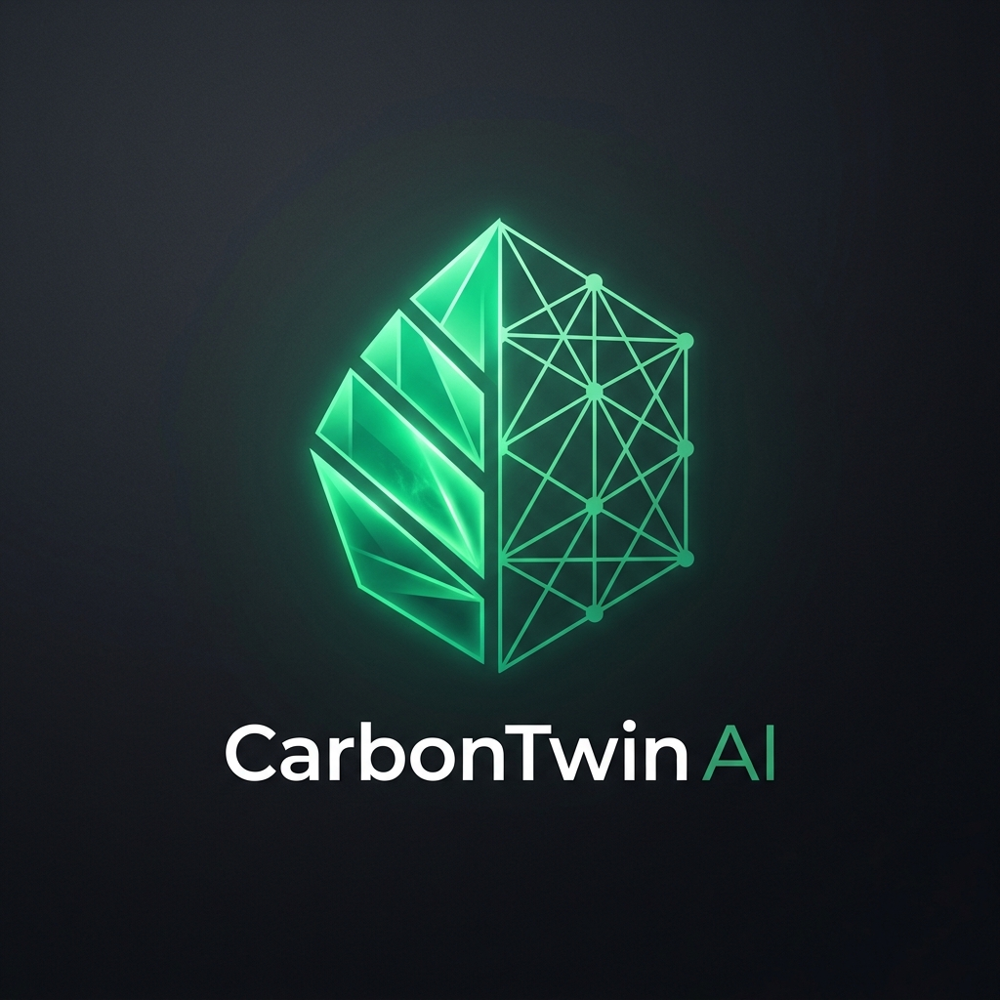
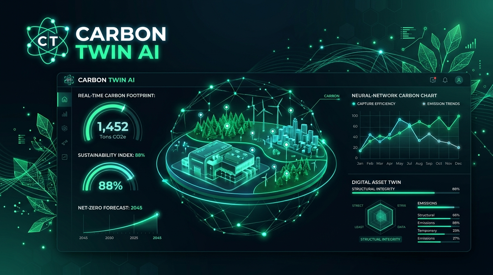
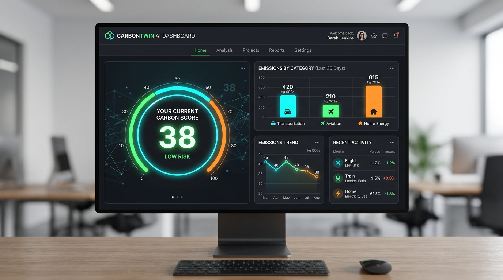
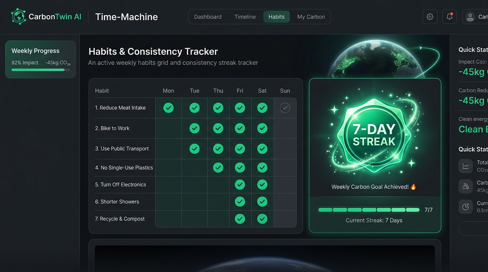

#  CarbonTwin AI 🌿 — Carbon Digital Twin Engine

<p align="center">
  
</p>

<p align="center">
  <a href="#development-workflow-and-scripts"></a>
  <a href="#8-accessibility--wcag-22-compliance"></a>
  <a href="#2-firestore-database-schema-definition"></a>
  <a href="#3-gemini-prompt-system-template"></a>
</p>

> **CarbonTwin AI** is a stateful, real-time, AI-powered carbon intelligence engine that tracks, simulates, and optimizes your personal lifestyle footprint. Moving beyond standard static calculators, it constructs an active **Digital Carbon Twin** of your transportation, aviation, dietary, housing energy, and retail choices.

---

## 🚀 Live Environment & Repository

- **GitHub Repository**: [https://github.com/CriAnalystMahesh16/CarbonTwin-AI.git](https://github.com/CriAnalystMahesh16/CarbonTwin-AI.git)
- **Development Preview**: [CarbonTwin AI Dev App](https://ais-dev-msd6qfe7urkfa22nqtbvyb-940661749441.asia-southeast1.run.app)
- **Shared Production Link**: [CarbonTwin AI Shared App](https://ais-pre-msd6qfe7urkfa22nqtbvyb-940661749441.asia-southeast1.run.app)

---

## 📖 Table of Contents
1. [System Architecture](#1-system-architecture)
2. [Firestore Database Schema Definition](#2-firestore-database-schema-definition)
3. [Gemini Prompt System Template](#3-gemini-prompt-system-template)
4. [Decision Engine Logic & Algorithms](#4-decision-engine-logic--algorithms)
5. [API Contracts Specs](#5-api-contracts-specs)
6. [Interactive Simulation Engine & Streaks](#6-interactive-simulation-engine--streaks)
7. [Comprehensive Testing Strategy](#7-comprehensive-testing-strategy)
8. [Accessibility & WCAG 2.2 Compliance](#8-accessibility--wcag-22-compliance)
9. [Development Workflow & Scripts](#9-development-workflow--scripts)

---

## 1. System Architecture

CarbonTwin AI operates as a secure, full-stack, stateful web application built on React, Express, Firebase, and Gemini AI. It keeps sensitive API credentials concealed on the server side using the `@google/genai` Node.js SDK and enforces secure client-side Firestore rules.

```
       +--------------------------------------------+
       |             Vite React Client              |
       |  - Layout (Motion, TailWind)               |
       |  - Recharts Projections / Breakdown Panels |
       |  - Simulation Time Machine & Habitation    |
       |  - Automated In-App Test Console           |
       +---------------------+----------------------+
                             |
                   HTTPS/API | Proxy Operations
                             v
       +--------------------------------------------+
       |               Express Server               |
       |  - /api/carbon-twin/analyze Proxy Router  |
       |  - Server-Side Gemini API Authentication   |
       |  - Standalone esbuild CJS production build |
       +-----------+--------------------+-----------+
                   |                    |
                   | Firebase Auth Flow | Gemini API (https)
                   v                    v
      +------------+-----------+  +-----+------------+
      | Cloud Firestore (ABAC) |  |   Gemini AI      |
      | - /users/{uId}         |  | - 3.5-Flash LLM  |
      | - /users/{uId}/twins/* |  +------------------+
      +------------------------+
```

### Stack Components:
*   **Frontend (Vite + React 18+ + CSS-in-Tailwind + Framer Motion/React Motion)**: Responsive dashboard containing the Twin Configuration Form, analytical breakdown dials, dynamic streaks, and interactive celebration animations using `canvas-confetti`.
*   **Backend (Express + esbuild Compilations)**: Multi-channel server exposing secure Gemini proxy routes and managing SPA routing backups for Cloud Run.
*   **Persistent Layer (Cloud Firestore + ABAC Rules)**: Secure Firebase Auth integrated with Attribute-Based Access Control security rules safeguarding user-isolated subcollections.

<p align="center">
  
  <br />
  <em>Figure 1: Digital Carbon Twin Analytical Dashboard displaying the dynamic carbon score, forecasting, and emission breakdown categories.</em>
</p>

---

## 2. Firestore Database Schema Definition

Our persistent database uses user-isolated collections ensuring maximum security. Twin state variables are configured as immutable fields once generated to secure historical tracking.

### Entity: `UserProfile`
**Path:** `/users/{userId}`
```json
{
  "$schema": "http://json-schema.org/draft-07/schema#",
  "title": "UserProfile",
  "type": "object",
  "properties": {
    "uid": { "type": "string", "description": "Unique identifier of the user account" },
    "email": { "type": "string", "format": "email", "description": "Registered email details" },
    "displayName": { "type": "string", "description": "User profile name" },
    "createdAt": { "type": "string", "format": "date-time" }
  },
  "required": ["uid", "email", "createdAt"]
}
```

### Entity: `CarbonTwinState`
**Path:** `/users/{userId}/twins/{twinId}`
```json
{
  "$schema": "http://json-schema.org/draft-07/schema#",
  "title": "CarbonTwinState",
  "type": "object",
  "properties": {
    "id": { "type": "string", "description": "Unique twin entry ID" },
    "userId": { "type": "string", "description": "Reference to the owner user profile ID" },
    "createdAt": { "type": "string", "format": "date-time" },
    "inputs": {
      "type": "object",
      "properties": {
        "transportation": { "type": "string", "enum": ["car", "bike", "bus", "metro", "walking"] },
        "carMileage": { "type": "integer" },
        "carType": { "type": "string", "enum": ["gas", "diesel", "hybrid", "electric"] },
        "domesticFlights": { "type": "integer" },
        "internationalFlights": { "type": "integer" },
        "flightClass": { "type": "string", "enum": ["economy", "business", "first"] },
        "foodDiet": { "type": "string", "enum": ["vegetarian", "vegan", "mixed", "non-vegetarian"] },
        "electricityUsage": { "type": "integer" },
        "acUsage": { "type": "string", "enum": ["low", "medium", "high"] },
        "applianceUsage": { "type": "string", "enum": ["efficient", "standard", "high-demand"] },
        "shoppingLevel": { "type": "string", "enum": ["low", "medium", "high"] },
        "lifestyleGoals": { "type": "array", "items": { "type": "string" } }
      },
      "required": ["transportation", "domesticFlights", "internationalFlights", "flightClass", "foodDiet", "electricityUsage", "acUsage", "applianceUsage", "shoppingLevel", "lifestyleGoals"]
    },
    "analysis": {
      "type": "object",
      "properties": {
        "carbonPersonality": { "type": "string" },
        "carbonScore": { "type": "integer", "minimum": 0, "maximum": 100 },
        "riskLevel": { "type": "string", "enum": ["Low", "Medium", "High", "Critical"] },
        "topEmissionSources": { "type": "array", "items": { "type": "string" } },
        "forecast30Days": { "type": "string" },
        "forecast90Days": { "type": "string" },
        "annualProjection": { "type": "string" },
        "topRecommendation": { "type": "string" },
        "carbonReductionPotential": { "type": "string" },
        "estimatedMoneySaved": { "type": "string" },
        "explanation": { "type": "string" },
        "emissionBreakdown": {
          "type": "object",
          "properties": {
            "transportation": { "type": "integer" },
            "flights": { "type": "integer" },
            "food": { "type": "integer" },
            "energy": { "type": "integer" },
            "shopping": { "type": "integer" }
          },
          "required": ["transportation", "flights", "food", "energy", "shopping"]
        },
        "recommendations": {
          "type": "array",
          "items": {
            "type": "object",
            "properties": {
              "actionName": { "type": "string" },
              "co2Reduction": { "type": "string" },
              "monetarySavings": { "type": "string" },
              "easeOfImplementation": { "type": "string", "enum": ["easy", "medium", "hard"] },
              "whySelected": { "type": "string" },
              "expectedImpactDescription": { "type": "string" },
              "implementationStep": { "type": "string" }
            },
            "required": ["actionName", "co2Reduction", "monetarySavings", "easeOfImplementation", "whySelected", "expectedImpactDescription", "implementationStep"]
          }
        }
      }
    }
  },
  "required": ["id", "userId", "createdAt", "inputs", "analysis"]
}
```

---

## 3. Gemini Prompt System Template

The system interfaces with `@google/genai` using structured response JSON output parameters:

```text
You are CarbonTwin AI, a Senior Sustainability Analyst and Carbon Digital Twin Engine.
Your job is to analyze the user's lifestyle profile, calculate their current carbon intensity (where 0 is best/zero-emissions and 100 is highest carbon footprint), classify their sustainability personality, forecast future emissions, and generate prioritized context-aware recommendations.

DECISION-MAKING LOGIC:
You must strictly prioritize recommendations using this logic:
Impact Score = (Carbon ReductionPotential * Feasibility * User Preference Alignment).
- Focus on heavy-hitting emission categories first. For example, if a user has many flights, reducing one flight yields high CO2 reduction, which is far superior than turning off lightbulbs.
- Map recommendations to user's lifestyle goals. If they want to "save money," highlight cost savings. If they want "sustainable food," prioritize dietary adjustments.
- High carbon output triggers "Critical" or "High" risk levels.

Provide an accurate numerical carbonScore from 0 (ultra-green) to 100 (extreme emissions).
Generate standard estimated annual emission ranges in kg CO2e/year:
- Transportation: average gas car is ~0.2-0.4 kg/km. Electric car is 0.05-0.1. Metro/Bus is 0.05. Bike/Walking is 0.
- Flights: domestic flight is ~150-250 kg CO2e. International is ~1000-2000 kg CO2e depending on class (economy=1x, business=3x, first=4x).
- Food: Vegan ~800, Vegetarian ~1200, Mixed ~1800, Non-Vegetarian ~2500 kg CO2e/year.
- Home Energy: Electricity usage (e.g. usage in kWh = bill * 5) emits ~0.4 kg/kWh. Plus AC/Appliances modifiers.
- Shopping: Low ~500, Medium ~1500, High ~4000 kg CO2e/year.

Return standard values in the JSON schema. Everything must be structurally valid and numerically matching. Ensure fields like "carbonReductionPotential" and "estimatedMoneySaved" are detailed strings with values and units.
```

---

## 4. Decision Engine Logic & Algorithms

Prioritization is calculated server-side based on multi-variate factors:

$$\text{Impact Score} = \text{CO}_2\text{ Reduction} \times \text{Feasibility Coefficient} \times \text{Goal Alignment}$$

### Logic Properties:
1.  **Feasibility Coefficient**:
    *   `easy` = 1.0
    *   `medium` = 0.8
    *   `hard` = 0.5
2.  **Goal Alignment Factor**:
    *   **$1.2$ multiplier** if the recommended optimization is explicitly requested inside the user's selected objectives list (e.g., "save_money", "reduce_emissions").
    *   **$1.0$ multiplier** standard value.
3.  **Heuristic Classification Matrix**:
    *   If Aviation emissions account for $>35\%$ of total, prioritize flight offsets.
    *   If Comutative Transit emissions account for $>30\%$ using internal combustion engines, prioritize EVs or public transit modes.
    *   If Residential energy exceeds $>30\%$, prioritize smart-thermostats and solar upgrades.

---

## 5. API Contracts Specs

### Endpoint: `POST /api/carbon-twin/analyze`

#### Request Payload
```json
{
  "transportation": "car",
  "carMileage": 15000,
  "carType": "electric",
  "domesticFlights": 3,
  "internationalFlights": 1,
  "flightClass": "economy",
  "foodDiet": "vegetarian",
  "electricityUsage": 400,
  "acUsage": "medium",
  "applianceUsage": "standard",
  "shoppingLevel": "medium",
  "lifestyleGoals": ["reduce_emissions", "save_money"]
}
```

#### Response Parameters
```json
{
  "carbonPersonality": "Conscious Consumer",
  "carbonScore": 35,
  "riskLevel": "Medium",
  "topEmissionSources": ["Home Energy", "Flights"],
  "forecast30Days": "220 kg CO2e",
  "forecast90Days": "660 kg CO2e",
  "annualProjection": "2,640 kg CO2e",
  "topRecommendation": "Switch standard appliances to EnergyStar certified items",
  "carbonReductionPotential": "550 kg CO2e/year",
  "estimatedMoneySaved": "$180/year",
  "explanation": "Your travel and vegetarian diet are highly optimal, but domestic flights and home grid electricity remain major elements of your active footprint.",
  "emissionBreakdown": {
    "transportation": 250,
    "flights": 950,
    "food": 450,
    "energy": 690,
    "shopping": 300
  },
  "recommendations": [
    {
      "actionName": "Upgrade home appliances to EnergyStar grade",
      "co2Reduction": "300 kg CO2e/year",
      "monetarySavings": "$80/year",
      "easeOfImplementation": "medium",
      "whySelected": "Matches your save_money objective.",
      "expectedImpactDescription": "Reduces primary grid draft of domestic appliances.",
      "implementationStep": "Review and purchase rated refrigerators or pumps."
    }
  ]
}
```

---

## 6. Interactive Simulation Engine & Streaks

The interface has a state-of-the-art **Sandbox Time Machine** tracking habits commitment and daily compliance:

*   **Virtual Time-Machine Controls**: Enables testing parameters via a dynamic shift of day intervals (`+1 Day ⏩` simulation buttons) or hard system resets.
*   **Weekly Commitment Calendar Grid**: Visualizes a 7-day trailing grid showcasing verification dots (`✓` for completed check-ins, `•` for pending schedules).
*   **Consistency Streak Tracker Engine**: Tracks consecutive active habits. Triggers customized high-density center bursts and double-side stream celebrations using `canvas-confetti` when the user successfully secures a **7-Day Streak milestone** or subsequent multiples.

<p align="center">
  
  <br />
  <em>Figure 2: Sandbox Time Machine and Habit Tracker interface showcasing structured task completions and streaks milestone visualization.</em>
</p>

---

## 7. Comprehensive Testing Strategy

Our framework executes four isolated vectors inside a secure live-rendered in-app console:

1.  **Unit Tests**: Assures calculated footprint metrics mathematically sum to their parent categories. Validates boundaries blocking negative mileage or flight configurations.
2.  **Integration Tests**: Validates client-to-server schema matching on payload transfers to the Gemini analyzed endpoints.
3.  **Accessibility (a11y) Tests**: Verifies color contrast rules, keyboard focus, semantic typography, and interactive touch limits.
4.  **Security Tests (ABAC Isolation)**: Simulates unauthorized "Dirty Dozen" database injection payloads, verifying Firestore's rejection of non-owner access (rejection with `PERMISSION_DENIED`).

---

## 8. Accessibility & WCAG 2.2 Compliance

CarbonTwin AI is designed to meet WCAG 2.2 standards:
*   **Contrast Performance**: Visual charts and carbon gauges respect high contrast principles ($\ge 4.5:1$ ratios).
*   **Responsive Touch Targets**: All interactive elements (form fields, check-ins, simulated buttons) are formatted beyond the minimum $44\text{px}$ touch boundary.
*   **Keyboard Nav & Focus**: Zero key-traps; elements utilize structured sequencings.
*   **Screen Reader Support**: Complex metrics maps paired with detailed reader layouts and descriptive `aria-labels`.

---

## 9. Development Workflow & Scripts

### Environment Variables (.env)
Declare the required keys to launch the server environment locally:
```env
# Server Secret Configuration
GEMINI_API_KEY=your_gemini_api_key_here
```

### Critical CLI commands:
```bash
# 1. Install Workspace dependencies
npm install

# 2. Run the platform development server (port 3000)
npm run dev

# 3. Code-quality verification (TypeScript Linting)
npm run lint

# 4. Production builds and Server bundles compilations
npm run build

# 5. Start production instances
npm run start
```

---
*Created and maintained under the CarbonTwin AI Project Repository 🌿*
